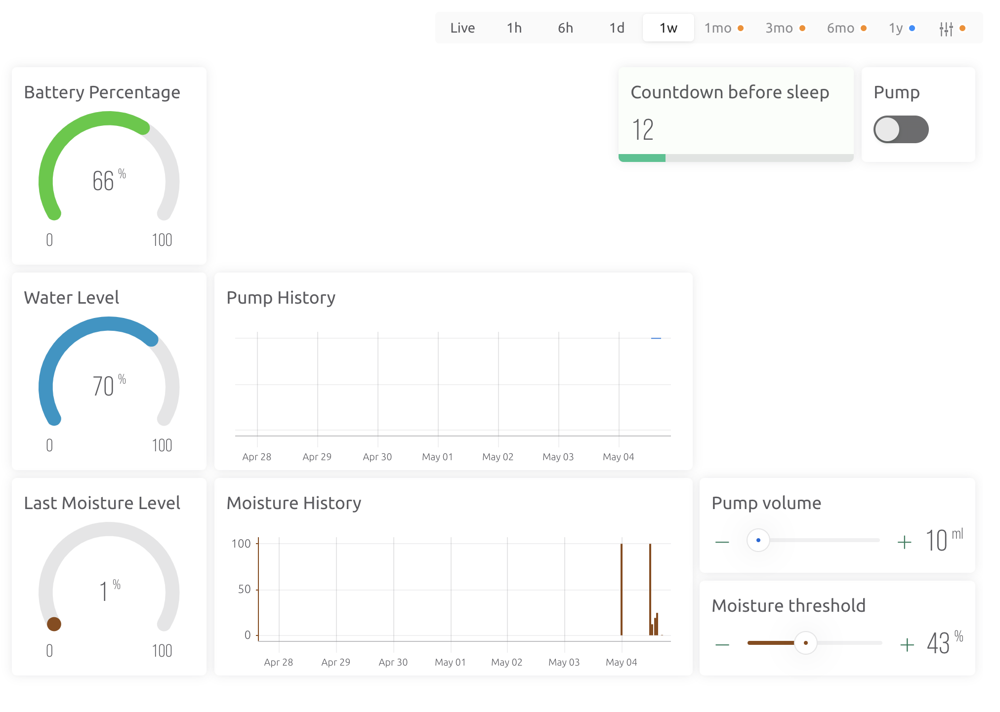

## Blynk Instructions for Plantidote

This code is only useful if you want the vase to work with Blynk.

### Running the code
- Use platform.io to import the blynk folder
- Create myconfig.h file based on myconfig.sample.h
- Compile/upload it to the board

### Setting up the blynk dashboard
- Create a dashboard on Blynk with the following datastreams:
  - V0: Gauge for the battery voltage
  - V1: Gauge for the battery percentage
  - V2: Graph for the moisture level
  - V3: Gauge for the water level
  - V4: Slider for the moisture threshold
  - V5: Switch for the pump
  - V6: Pump history
  - V7: Pump volume
  - V8: Countdown before sleep

### Setting up the WiFi
Wifi settings are loaded from the config.h file
```
#define WIFI_SSID "xxxx"
#define WIFI_PASSWORD "xxxx"
```

But you can also update it via bluetooth on your phone.
- download Serial Bluetooth Terminal on [Android](https://play.google.com/store/apps/details?id=de.kai_morich.serial_bluetooth_terminal)
- press the button on the vase, it will wake up and enable bluetooth for 1 min
- go to your phone bluetooth settings and pair with the device "Plantidote"
- go to the Serial Bluetooth Terminal > Devices > Plantidote
- the terminal will open, you will be prompt to enter SSID and password in this form MyWifi::MyWonderfulPassword
- press enter to send the new SSID::password, that's it!

